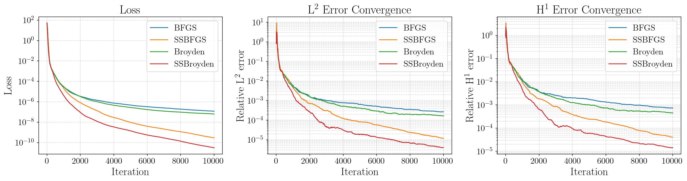

# Self-Scaled Broyden Family of Quasi-Newton Methods in JAX

A small add-on to the [Optimistix](https://github.com/patrick-kidger/optimistix) library, implementing the Self-Scaled Broyden family of quasi-Newton methods in [JAX](https://github.com/google/jax).

## Solvers

The repository provides the following quasi-Newton solvers:

| Solver        | `thetak` | `tauk`   | Description                                                               |
| ------------- | -------- | -------- | ------------------------------------------------------------------------- |
| **BFGS**      | 0        | 1        | Classic BFGS (with Zoom linesearch, not available in upstream Optimistix) |
| **SSBFGS**    | 0        | computed | Self-Scaled BFGS                                                          |
| **DFP**       | 0        | 1        | Classic DFP                                                               |
| **SSDFP**     | 1        | computed | Self-Scaled DFP                                                           |
| **Broyden**   | computed | 1        | Broyden family (no Self-Scaled)                                           |
| **SSBroyden** | computed | computed | Full Self-Scaled Broyden                                                  |

The implementation of the **Zoom linesearch** is taken (and merged into Optimistix with few changes) from [bagibence/zoom_linesearch](https://github.com/bagibence/optimistix/tree/zoom_linesearch).

## Class hierarchy

```
AbstractQuasiNewton
└── AbstractSSBroydenFamily
    ├── AbstractSSBroyden          (computed thetak, computed tauk)
    │   ├── SSBroyden              [concrete]
    │   └── AbstractBroyden        (computed thetak, tauk = 1)
    │       └── Broyden            [concrete]
    ├── AbstractSSBFGS             (thetak = 0, computed tauk)
    │   ├── SSBFGS                 [concrete]
    │   └── AbstractBFGS           (thetak = 0, tauk = 1)
    │       └── BFGS               [concrete]
    └── AbstractSSDFP              (thetak = 1, computed tauk)
        ├── SSDFP                  [concrete]
        └── AbstractDFP            (thetak = 1, tauk = 1)
            └── DFP                [concrete]
```

## Iteration counting

In [optimistix_wrapper.py](optimistix_wrapper.py), thanks to some minor modifications to Optimistix, we provide a utility function that counts the actual iterations of the method, separating them from linesearch iterations. By default, Optimistix does not distinguish between the two.

## Tests and examples

- **Tests**: basic correctness tests are in [test_implementations.py](test_implementations.py).
- **Example**: a PINNs (Physics-Informed Neural Networks) example is in [example.py](example.py). The example solves the 3D Poisson equation with PINNs. As visible from the results below, the self-scaled versions of the optimizers perform notably better.

<p align="center">
  
  <br>
  <em>3D Poisson equation solved with PINNs. The self-scaled versions of the optimizers (SSBFGS and SSBroyden) perform notably better than the unscaled ones.</em>
</p>

## Installation

1. **Clone the repository**
   ```bash
   git clone https://github.com/IvanBioli/ssbroyden_jax.git
   cd ssbroyden_jax
   ```

2. **Initialize and update the submodules**
   ```bash
   git submodule init
   git submodule update
   ```

3. **Create a conda environment and install dependencies**
   ```bash
   conda create -n optimistix_env python=3.11 -y
   conda activate optimistix_env
   ```

   Install JAX with CUDA 13 support (or any other JAX variant you need):
   ```bash
   pip install jax[cuda13]
   ```

   Install the Optimistix submodule:
   ```bash
   pip install -e ./optimistix
   ```

4. **(Optional) Install Jupytext and convert the example to a notebook**
   ```bash
   pip install jupytext ipykernel matplotlib
   jupytext --to notebook example.py
   ```
